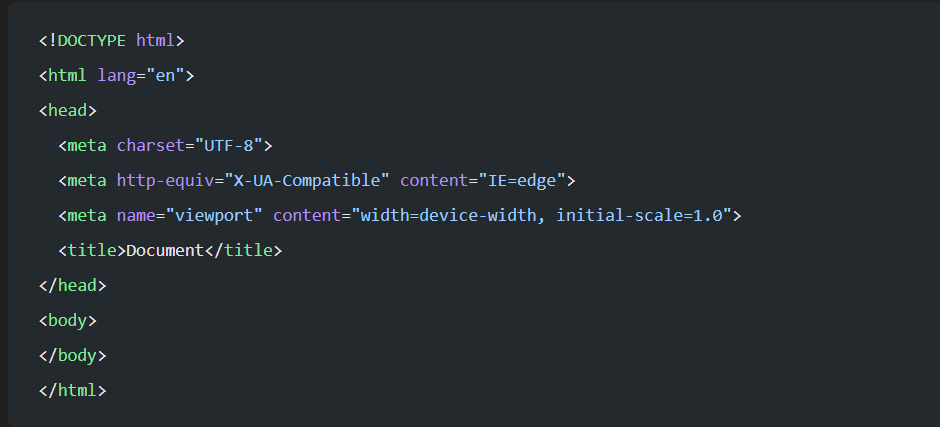

# Atajos VSC para HTML

Desde esta sección podrás encontrar los diferentes atajos de teclado para programar en HTML.

Si ves que falta alguno puedes participar libremente o hacermelos llegar si lo prefieres.

## !

Al escribir el simbolo de cierre de exclamación VSC nos añadirá directamente toda la estructura básica de nuestro archivo html.

